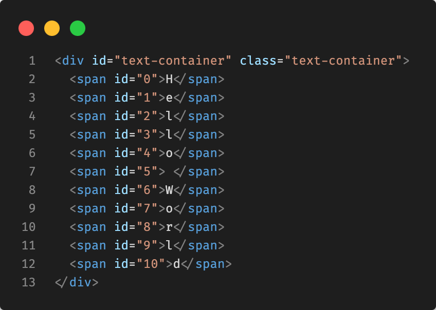

# Add Span Text

>npm i add-span-text

>import package

```js
import addSpanText from 'add-span-text';
```

>calling addSpanText function from a package with text to animate

```js
addSpanText('hello world');
````

>Add this container in html - div or p or whatever you want but with<mark> id="text-container" class="text-container"</mark> 

```html
<div id="text-container" class="text-container"></div
```

